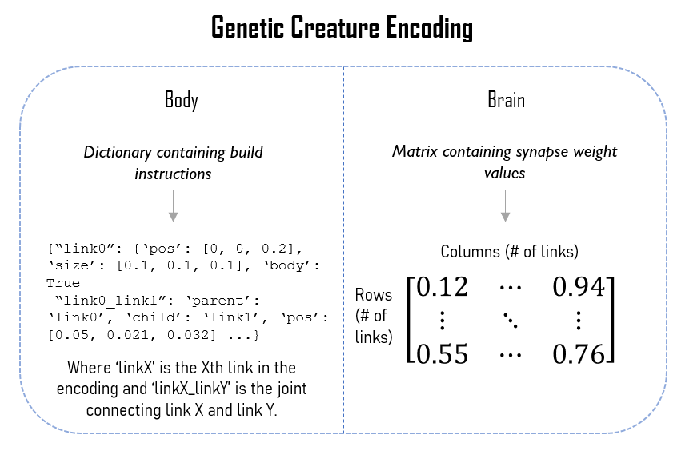
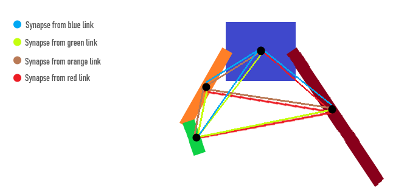
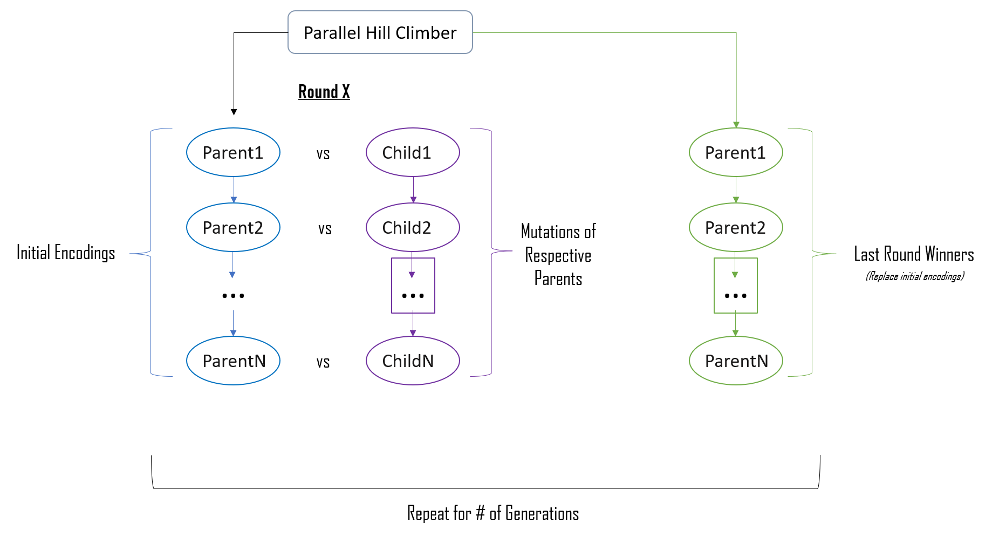

# Computer Science 396: Artificial Life

## Final Project (The Artist)

### What is this?
This project is centered around evolving virtual creatures made up of simulated blocks and neurons. We start by spawning unevolved creatures of a certain random configuration, then there creatures "learn" to complete a specified task automatically over time! Throughout this short blog we will walk through this evolution process and how we implement it.

The creatures in this project are evolved by piecing together "main body" links. Mutations can be: slicing mutations that cut the genome at some point, combination mutations that graft two sliced creatures together, and standard weight mutations that change weights in the creatures brain. A diverse set of ancestors are created, and over time these configurations are evolved by the above mentioned operations.

This setup is used as I wanted to enforce a catepillar-like evolution progression. The fitness function used minimizes 
```
y+h
```
where y is the final y coordinate of the creature and h is the maximum height the creature reached during its life.

### Starting Genotypes and Mutations


Ancestor (first parent) encodings are generated as shown above, then further encodings are evolved. The below figure showcases the two of the three mutation possiblities.


Here's an example of how we encode information into our creatures. This is the genetic information that is transfered and mutated over time.



### Creature brain structure
All creature brains are fully connected. During slicing synapses are removed from removed links/joints, and during combining synapses are retained. Sometimes combining errors (mutations) can occur that prevent weights from being carried over, resulting in random weights.

A visualization of a fully connected brain given a random 4-link creature morphology is shown below.



### The evolution paradigm

A parallel hill climber is used to evolve creatures over time. An abstract visualization of the process is shown below.



### Fitness pilot


Here is the result of max fitness (y axis) versus number of generations (x axis) for 5 runs. Each run was made with a random seed (0, 1, ..., 4).

### Codebase Description
The solution.py file houses most of the inner workings of the mutation process. [Mutate()](solution.py#L37) accomodates slice and graft operations. [Create_Brain](solution.py#L80) carries over existing creature weights when using slicing and grafting to mutate. Creating the brain connections is relegated to [sendSynapses()](solution.py#L113). [makeFromEncoding()](solution.py#L129) uses a newly introduced dictionary encoding of a genome and creates a URDF file from it. [sliceEncoding()](solution.py#L150) and [deleteNames()](solution.py#L167) comprise the functionality of the slicing operation over an encoding, and [combineSlices()](solution.py#L191) does the same for combining slices when grafting.

For more details, all linked code is documented.

### Running
Clone repository and, assuming the requisite enviroment with pybullet installed, one can run one of two options:

To run a randomly generated creature:
```
python main.py random
```

To run a creature from the saved body and brain data:
```
python main.py saved
```

### Brief Visualization
https://youtu.be/ly3jJqFNsN0

### References
[Education in Evolutionary Robotics](https://www.reddit.com/r/ludobots/) is used as the basis for the parallel hill climber and most of the codebase.
[Evolving Virtual Creatures](https://www.karlsims.com/papers/siggraph94.pdf) is referenced for genotype graph inspiration.
[Pyrosim](https://ccappelle.github.io/pyrosim/) is the foundational framework for body and brain simulation used by LudoBots.
