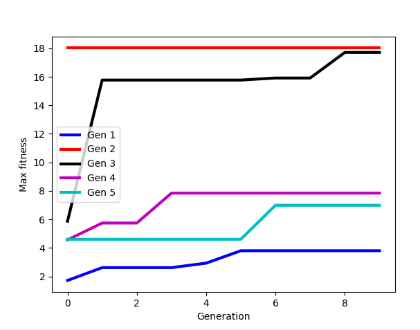

# cs397-ludobots

## Assignment 8

### What's the rundown?
The creatures in this project are evolved by piecing together "main body" links. Mutations can be: slicing mutations that cut the genome at some point, combination mutations that graft two sliced creatures together, and standard weight mutations that change weights in the creatures brain. A diverse set of ancestors are created, and over time these configurations are evolved by the above operations.

This setup is used as I wanted to enforce a catepillar-like evolution progression in light of my final project idea. The fitness function used minimizes 
```
y+h
```
where y is the final y coordinate of the creature and h is the maximum height the creature reached during its life.


### Genotype graph


Ancestor (first parent) encodings are generated as previously in Assignment 6 (above), further encodings are evolved. The below figure showcases the two of the three mutation possiblities.


All creature brains are fully connected. During slicing synapses are removed from removed links/joints, and during combining synapses are retained. Sometimes combining errors (mutations) can occur that prevent weights from being carried over, resulting in random weights.

### Fitness plot



Here is the result of max fitness (y axis) versus number of generations (x axis) for 5 runs. Each run was made with a random seed (0, 1, ..., 4).

### Codebase Description
Extensive modifications are made to this codebase, especially in the solution.py file. [Mutate()](solution.py#L37) is changed to accomated the slice and graft operations. [Create_Brain](solution.py#L80) is modified to carry over existing creature weights when using slicing and grafting to mutate. Sending neurons has been relegated to [sendSynapses()](solution.py#L113). [makeFromEncoding()](solution.py#L129) uses a newly introduced dictionary encoding of a genome and creates a URDF file from it. [sliceEncoding()](solution.py#L150) and [deleteNames()](solution.py#L167) comprise the functionality of the slicing operation over an encoding, and [combineSlices()](solution.py#L191) does the same for combining slices when grafting.

For more details, all linked code is (at least somewhat) documented.

### Running
Clone repository and, assuming the requisite enviroment with pybullet installed, run
```
python main.py random
```

### Brief Visualization
https://youtu.be/ly3jJqFNsN0

## Assignment 7

### Genotype graph


All creature brains are fully connected. So technically any sensor can activate any motor in a given creature.

### Codebase Description
Creature morphology is handled within the [solution.py](solution.py) file. Notably, [createBodyFromEncode()](solution.py#L153) takes an encoding (a placeholder that sends the number of main body or "base" links for the time being) from [getRandomEncoding()](solution.py#L68) to build a creature. Interesting helper functions include [getStemPos()](solution.py#L83), which creates joint positions from where limbs grow, [positLink()](solution.py#L125), which places limbs such that one of their vertices stems from the limb joint (or "stem_pos"), and [grow()](solution.py#L195), which recursively grows limbs with a diminishing chance (starts at 80%, -20% for each limb grown).

For more details, all linked code is substantially documented.

### What's the rundown?
Most creatures appear as a link of 1 to 3 sizeable main body links with limb random protrusions. These limbs stem from a main body and only grow sequentially on top of each other, stemming from random locations. Limbs can be of two configurations: a short-short-long and a long-long-short config. This results in 1) stick-like and 2) wing/flapper-like limbs. The main parameters that affect diversity are the "baseLinks" solution attribute (number of main bodies) and the grow chance (chance that limbs will grow recursively).

### Running
Clone repository and, assuming the requisite enviroment with pybullet installed, run
```
python main.py random
```

### Brief Visualization
https://youtu.be/jhMVZn2n3mA

### References

[Evolving Virtual Creatures](https://www.karlsims.com/papers/siggraph94.pdf) is referenced for genotype graph inspiration.

(No other references or outside information are used.)

## Assignment 6

### Running
Clone repository and, assuming the requisite enviroment with pybullet installed, run
```
python main.py random
```
for different variations of kinematic chains (jointed snakes) with random behaviour.

### Brief Visualization

https://youtu.be/ggGimPSdQyE
